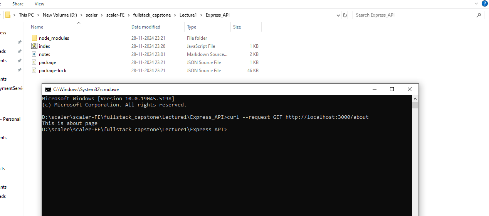
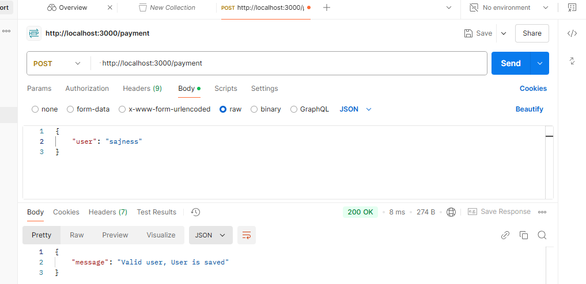
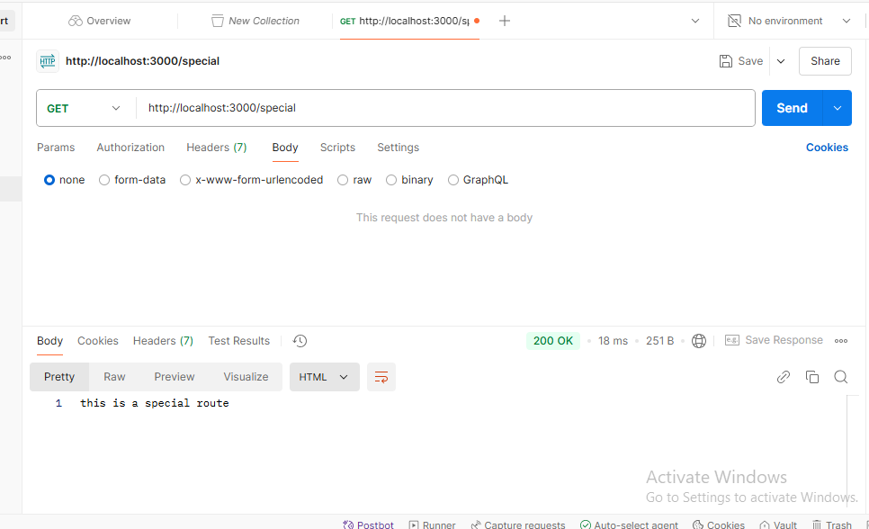
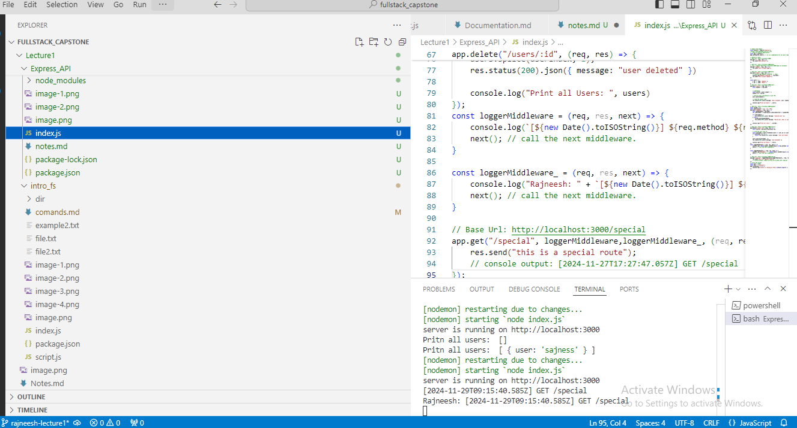

## APis
   In backend developement, an API of various endpoints or routes that define specific functionality or service that your server provide. 

## Express
In Node.js, the Express module is a popular framework for building web applications and APIs. It simplifies the process of handling HTTP requests and responses and provides a structured way to create routes and middleware.

   1. Simpler and cleaner syntax

   2. Code readability

   3. Middleware: One of the core features of Express is its
     convenience in use of middleware, which are functions that have
     access to the request object (req), the response object (res), and
     the next middleware function in the application’s
     request-response cycle. 

    4. Routing: Express provides a straightforward way to define routes
     and handle different HTTP methods (GET, POST, PUT, DELETE,
     etc.). In vanilla Node.js, you'd typically have to handle URLs and
     methods manually, which can be cumbersome.

Setting up an express application.
    Step 1: create a file index.js
    Step 2: npm init -y
    Step 3: npm install express --save
    step 4: sudo npm i nodemon -g   (it will install nodemon at global level)
## with curl

when u call speical route from postmean u will get output in console

