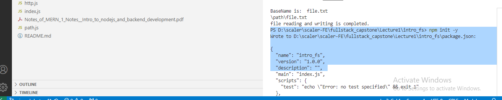
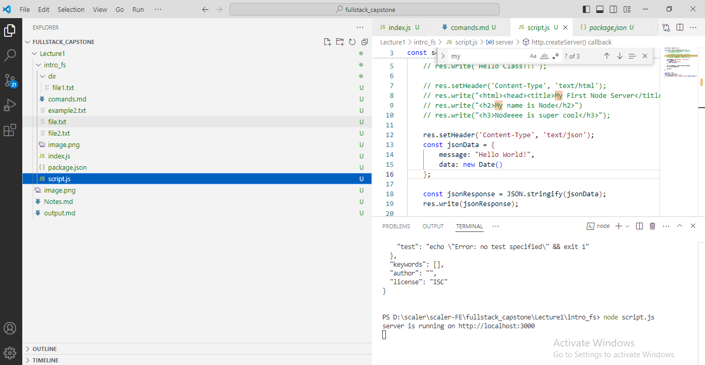
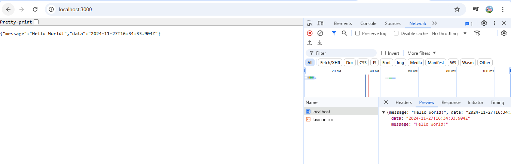

npm init -y // will c reate pacage.json

What is the difference between NPX and NPM medium? NPM is a package management that is used to install, uninstall, and update Javascript packages on your workstation, whereas NPX is a package executer that is used to directly execute Javascript packages without installing them.

Installation:
You can install Nodemon globally using npm (Node Package Manager) with the following command:

2. npm install -g nodemon
Alternatively, you can install it as a development dependency in your project by running the following command inside your project directory:

3. npm install --save-dev nodemon

# nodemon
nodemon is a tool that helps develop Node.js based applications by automatically restarting the node application when file changes in the directory are detected.

nodemon does not require any additional changes to your code or method of development. nodemon is a replacement wrapper for node. To use nodemon, replace the word node on the command line when executing your script.

Using nodemon is simple, if my application accepted a host and port as the arguments, I would start it as so:

## Basic Usage:
After installing Nodemon, you can use it to run your Node.js application instead of the standard node command. For example:

1. nodemon your-app.js
nodemon ./server.js localhost 8080

