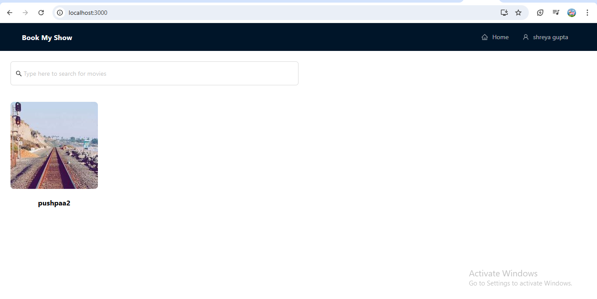
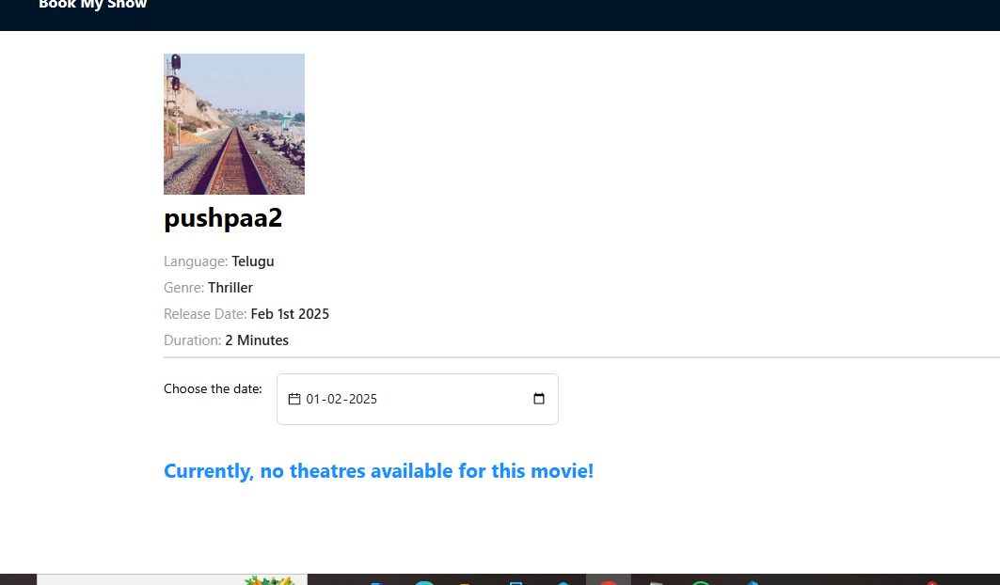
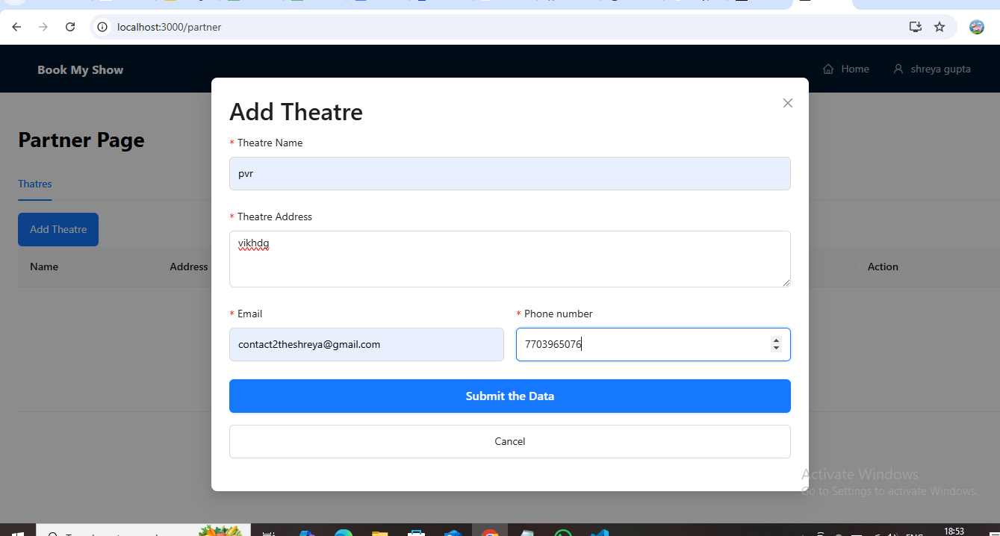
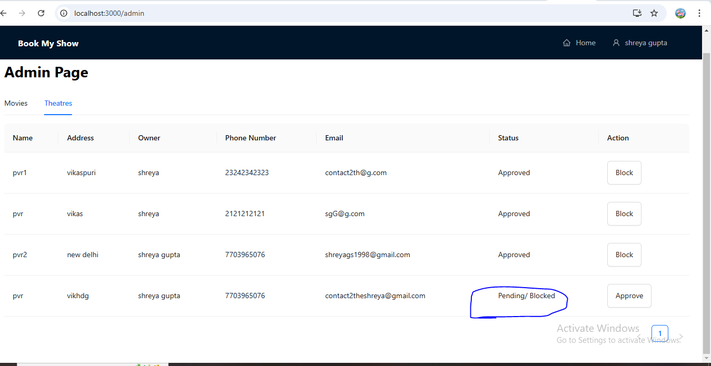
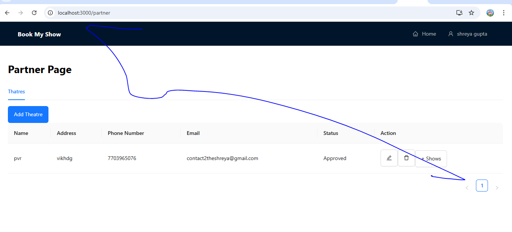
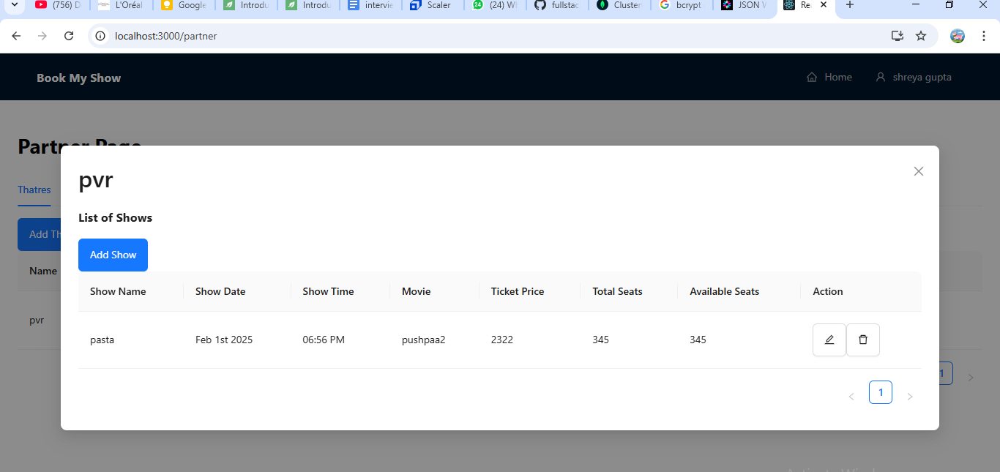
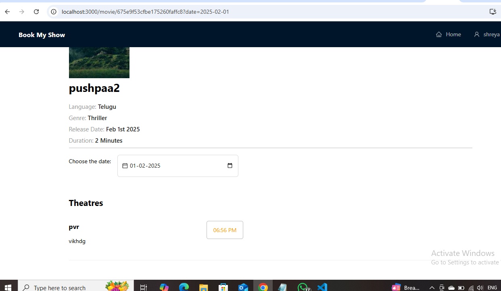
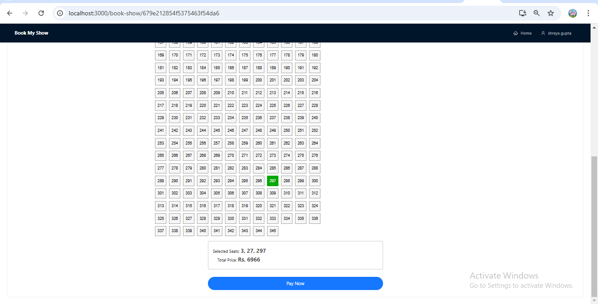
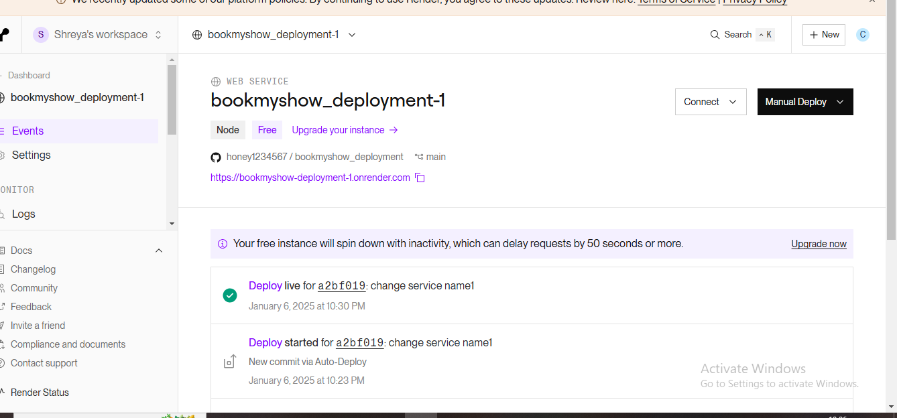

## Run  client- first terminal
1. cd bookmyshow/client
2. npm start
 http://localhost:3000/partner
 partner will add thetare and show
  http://localhost:3000/admin
 admin will aprove thetre then partner can add show
 Go to home page and see shows on particular date
   http://localhost:3000

## Run server - 2nd terminal

1. cd bookmyshow/server-> nodemon server.js
2. Mongodb login with gmai crenetial to see database

## credntials to login
contact2theshreya@gmail.com/sherpauts

click in movie

add theatre

Approve it

Add show

Select same showw date on same above movie and see thatre on movie

click on time->book seat->pay now
 which is integrated with stripe

#  Note
In cloud deployment and steps to run
Refer 
https://github.com/honey1234567/bookmyshow_deployment/blob/main/server/notes.md
