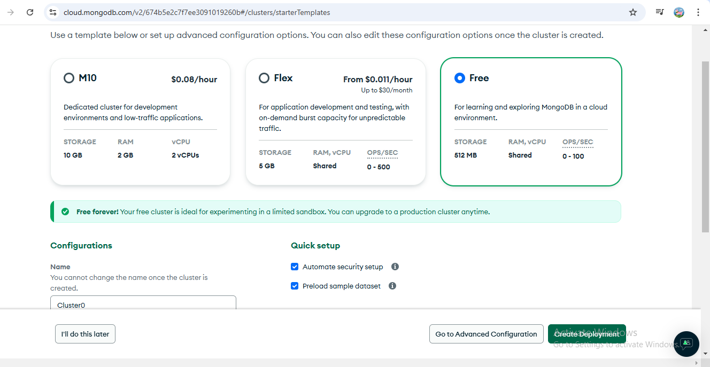

## To setup project
npm init -y && npm i express && npm i mongose
Sigin in mogodb website and create new project by just giving name of your project


create cluster and choose free option

Signin with google
DB credential-root/password@123
connection  method - mongodb for vscode

allow to add Ip address to acess from anywhere

connect to mongodb deployment
mongodb+srv://root:<db_password>@cluster0.gsd1u.mongodb.net/

/////////////////////////////////////////////////////////////////////////////
## Revision Notes for MongoDB and Mongoose Class
Introduction to MongoDB
# What is MongoDB?
MongoDB is an open-source document-oriented NoSQL database used for handling large volumes of data. It stores data in flexible, JSON-like documents called BSON (Binary JSON).
MongoDB Architecture
MongoDB organizes data into databases, collections, and documents:
Databases: Contains collections.
Collections: Similar to tables in SQL, but without a fixed schema.
Documents: Key-value pairs similar to rows, but each document can have a different structure.【8:9†typed.md】
Key Concepts
BSON is a binary representation of JSON-like documents, allowing MongoDB to efficiently store and query data.
Collections act as containers for documents and can have different structures within the same collection.
Documents are the core data units in MongoDB, allowing schema flexibility within collections.【8:9†typed.md】
Real-World Example
For an e-commerce platform, a Products collection can contain documents such as:
{
  "_id": ObjectId("..."),
  "name": "Smartphone",
  "brand": "XYZ",
  "price": 699,
  "specs": {...}
}
```【8:9†typed.md】
Introduction to Mongoose
# What is Mongoose?
Mongoose is an Object Data Modeling (ODM) library for MongoDB and Node.js, providing a higher-level abstraction over MongoDB to facilitate schema definition and data validation through models.
# # Defining Schemas
A Schema is a structure that defines the shape of documents, default values, and validation requirements:# 
const productSchema = new mongoose.Schema({
  product_name: { type: String, required: true },
  product_price: { type: String, required: true },
  isInStock: { type: Boolean, required: true },
  category: { type: String, required: true },
}, { timestamps: true });


Fields like product_name, product_price are defined with types and constraints.
timestamps: true automatically adds createdAt and updatedAt fields.【8:10†typed.md】


Models in Mongoose


A Model in Mongoose is created from a schema and represents a MongoDB collection which provides methods for CRUD operations.
const ProductModel = mongoose.model("products", productSchema);
This line associates the ProductModel with the products collection in the database.【8:11†typed.md】
CRUD Operations with Mongoose
Creating a Product
# To create a new product:
app.post("/api/products", async (req, res) => {
  const product = await ProductModel.create(req.body);
  res.status(201).json({ message: 'Product Created' });
});
The server receives a JSON object, creates a new product using Mongoose, and returns a success message.【8:12†typed.md】
# Reading Products
Get all products:

app.get("/api/products", async (req, res) => {
  const allProducts = await ProductModel.find({});
  res.json(allProducts);
});

# Get a product by ID?

app.get("/api/products/:id", async (req, res) => {
  const product = await ProductModel.findById(req.params.id);
  res.json({ product });
});
Efficiently retrieves data using unique ID, making use of MongoDB's indexing.【8:13†typed.md】
# Updating Products
Products can be updated using their ID:
app.put("/api/products/:id", async (req, res) => {
  await ProductModel.findByIdAndUpdate(req.params.id, req.body);
  res.json({ message: 'Resources Updated' });
});
This uses findByIdAndUpdate to modify existing records based on unique identifiers.【8:13†typed.md】
# Deleting Products
Products are deleted similarly using their ID:
app.delete("/api/products/:id", async (req, res) => {
  await ProductModel.findByIdAndDelete(req.params.id);
  res.json({ message: 'Resource Deleted' });
});

# Handling Large Data Sets
As data grows (to billions or trillions of records), a structured database like MongoDB provides better scalability due to its flexibility and efficient handling capabilities.【8:9†typed.md】

These notes capture the core technical aspects discussed in the class regarding MongoDB and Mongoose, focusing on how they work together in the context of web applications. The class thoroughly covered schema definitions, CRUD operations, and real-world applications of MongoDB's flexibility and Mongoose's object modeling capabilities.
