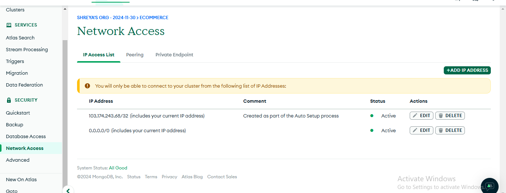
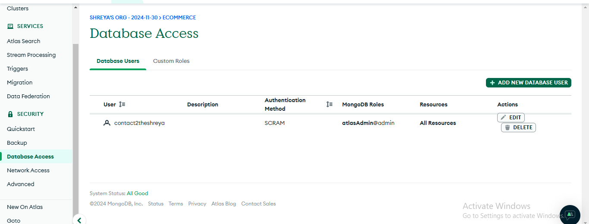
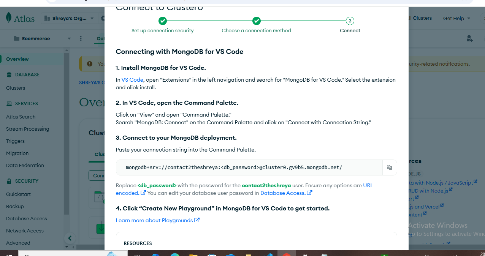
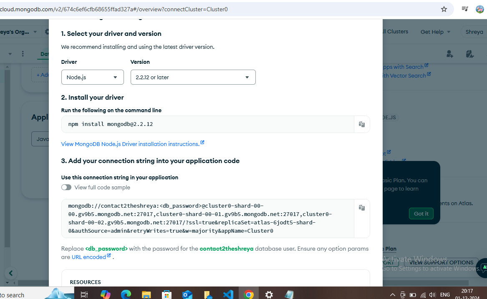
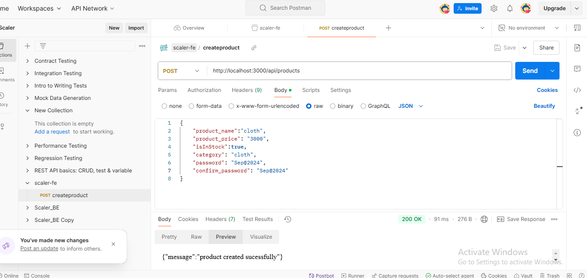
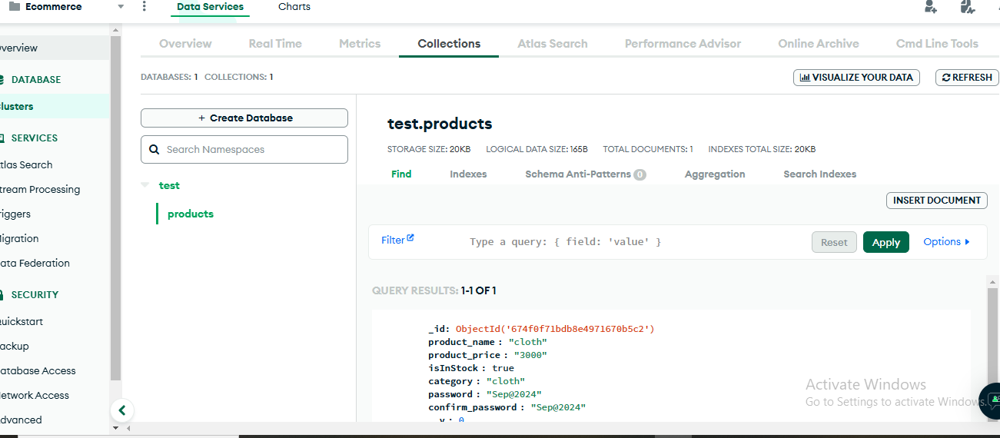

create project and cluster
choose free tier
setting required

connect with mon godb driver and change node version and use below conection string if above fails

## Run application

postman collection es saved in this folder import it in postman and hit api
see in cluster that product is created
